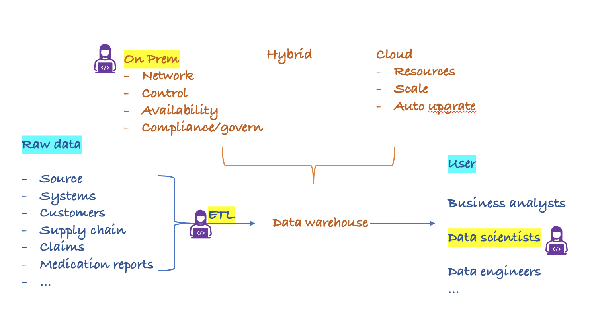

# etl_claims
A demo for ETL and analysis on health and dental plans data in the US Health Insurance Marketplace

 <h2 style="color:purple;" size = 3>My previous role on different projects</h2>

- ETL role: get the raw data into data warehouse, doing the converting/ standard formating and quality checking
- Data scientist role: use in house data to **perform analysis**, try different **ML models** to gain insight and do prediction, apply **large language models** on medication notes. 

- Database engineer role: build on premises databases and management system for user to do analysis and sumbit jobs 